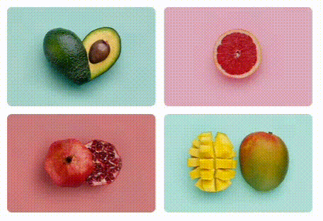
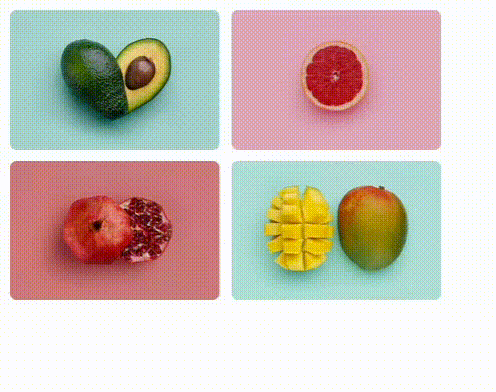

# Ymage

**Package is in beta - in production use is not recomended for now**
<br/><br/>
Ymage is react zero dependencies component that takes care of loading optimization, neat presentation, copyright protection,caching and some extras with just one line of code.


<p align="center">

</p>

✅ Advenced progressive JPEG recognition - image is rendered on first progressive scan avaiable - before `onLoad`.<br/>
✅ Sized, neat image placeholders for loading, error and copyright <br/>
✅ Short props for styling<br/>
✅ Image copy protection<br/>
✅ All image formats are compatible - progressive JPEG is just recommended way<br/>
✅ Callback with image dimensions `onSize`<br/>


<br/>

## Installation


```shell
$ npm install ymage
```

Import module to `yourcode.js`:
```JavaScript
import Ymage from 'ymage'
```


<br/>

## Usage


```JavaScript
<Ymage url="fruit.jpg" w={300} h={200} r={10}/>
```

Using `onSize` callback:

```JavaScript
function sizeHandler(size) 
	console.log("Image is " + size.x + " / " + size.y)
	
<Ymage copyright url={"fruit.jpg"} wh={2/3} h={200} onSize={sizeHandler} />
```

<br/>


### Styling
In order to properly create the loading shape of the Ymage, you can size it with two of the three properties (`w` + `h`), (`w` + `wh`) or (`h` + `wh`)

|Property|CSS|
|-|-|
|w|`width`|
|h|`height`|
|wh|`aspect-ratio` (width / height)|
|r|`border-radius`|
|bg|`background-color`|
|color|icons color|

<br/>

### Behavior
In addition to following you can use other html props on Ymage like `id`, `className`, `onClick` etc.

|Property|Default|Description|
|-|:-:|-|
|url| - |Image `url`|
|lazy| `200px` | Viewport distance from the image that trigges loading (values like css `margin`). Set to `false` to start loading immediately.|
|copyright|`false`|Basic anti-copy protection|
|type|`img`|HTML syntax tag to render image (`img` or `div`).|
|onLoad| - | Callback function on image fully fetched |
|onSize| - | Callback function with size (when using progressive jpeg it fires on first scan ready) returned as object in first argument `onLoad={(size) => ... size.x /size.y ...}`|

<br/>


<p align="center">
    
</p>


<br/>

